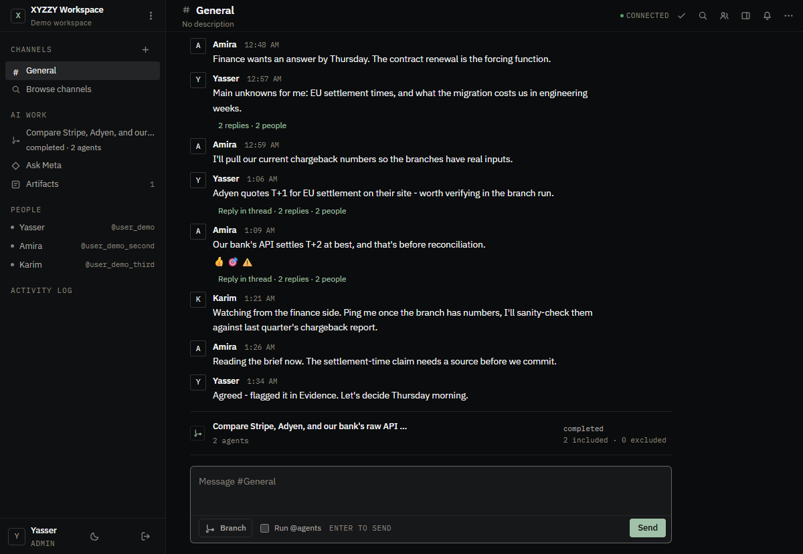
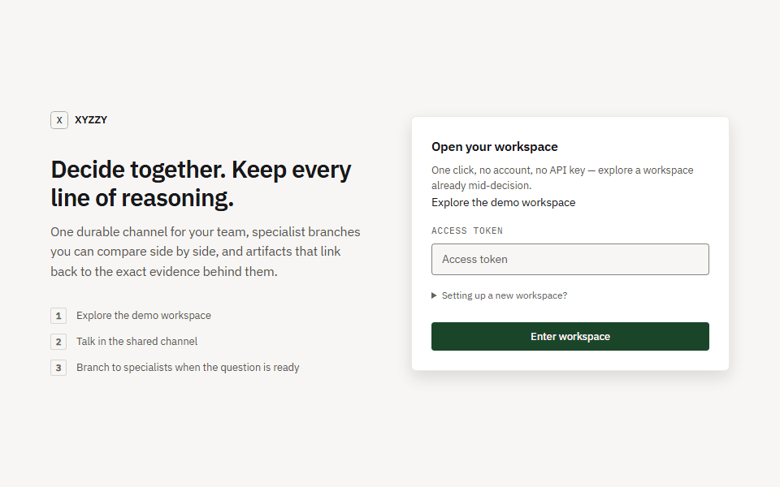

# XYZZY

A team makes a hard technical decision with AI, and keeps the receipts.

Live page: [xyzzy.yasserameur-dev.workers.dev](https://xyzzy.yasserameur-dev.workers.dev/)

[](https://github.com/Project-Nexus-YR/XYZZY/actions/workflows/ci.yml)
[](https://github.com/Project-Nexus-YR/XYZZY/actions/workflows/docker-publish.yml)
[](LICENSE)

<picture>
  <source media="(prefers-color-scheme: dark)" srcset="site/assets/screenshot-hero-dark.png">
  <source media="(prefers-color-scheme: light)" srcset="site/assets/screenshot-hero-light.png">
  
</picture>

## Try it

```bash
docker run -p 8000:8000 -e XYZZY_DEMO=1 ghcr.io/project-nexus-yr/xyzzy
```

Opens a seeded demo workspace at `http://localhost:8000`, signed in with one click. No account,
no config. Prefer to run from source? `git clone` this repo and run `docker compose run --rm
--service-ports demo` instead (see [Docker](#docker) below for the non-demo path).

### What the demo opens



One click drops you into a workspace already mid-decision: a channel conversation, a branch with
two specialist outputs to compare, and a published Decision Brief with its evidence chain intact.
No API key is configured for this recording, so the specialist outputs and the brief show the
conspicuously labelled SIMULATED workflow output described above; the collaboration mechanics
are the same either way.

## What it is

Modern AI tools are single-player: one human, one chat, one context. Real work happens in teams.
XYZZY lets multiple humans and AI agents share a room: a common event history, artifacts, tasks,
and decisions, persisted in SQLite with WebSocket-driven real-time sync. Agents branch out in
parallel, a human selects or excludes what comes back, and the room publishes an immutable
Decision Brief with the evidence chain behind it.

## Why it's different

**Governed.** Actions wait for human approval before they execute. What an agent may do is
re-read from the room's own state at the moment it acts, so leaving a room or losing access takes
effect immediately, mid-task.

**Provable.** Every room's event log is hash-chained: each event is hashed against the one
before it, so altering or deleting a row breaks every hash after it: tamper-evident by
construction, checkable with the audit CLI. This proves the log is internally consistent with
itself, and no more: it cannot tell an honest history from a wholesale rewrite by whoever holds
the database file. Each Decision links to the Claims and AgentOutputs behind it, so a synthesis is
inspectable down to the run that produced it.

**Yours.** One Python process and a SQLite file, self-hosted. Point specialists at Ollama, LM
Studio, or any OpenAI-compatible server instead of a hosted API. Apache-2.0 licensed, source included.

## Core Capabilities

- **Persistent rooms** with durable event sourcing (every action is an ordered event)
- **Multi-agent orchestration:** spawn, pause, resume, redirect, and delegate between agents
- **Human-in-the-loop:** request/approve/reject agent actions before execution
- **Artifact versioning:** create and version documents, code, and other artifacts
- **File attachments:** upload images to a message, capped by `XYZZY_MAX_ATTACHMENT_BYTES`
- **Selective synthesis:** explicitly include/exclude outputs and publish immutable Decision Briefs
- **Evidence ontology:** typed, reviewable Decision → Claim → AgentOutput relationships
- **Bounded Meta:** permission-aware “why” and decision-evidence answers with exact drill-down
- **Decision tracking:** record and audit architectural and product decisions
- **Shared memory:** room-scoped, workspace-scoped, and org-scoped memory
- **Real-time collaboration:** WebSocket broadcasting of all room events
- **Reconnect support:** full state snapshot + incremental event replay on reconnect

## Architecture

```
┌─────────────────────────────────────────────────────────┐
│                    Browser (web/index.html)              │
│                    WebSocket + REST API                  │
└──────────────────────────┬──────────────────────────────┘
                           │
┌──────────────────────────▼──────────────────────────────┐
│                 FastAPI Server (server.py)               │
│          REST endpoints (routes.py) + WS endpoint        │
├─────────────────────────────────────────────────────────┤
│              Service Layer (service.py)                  │
│     State machines · Input validation · Authorization   │
├──────────────────┬──────────────────────────────────────┤
│   RealtimeHub    │        NexusAgentBridge              │
│  Pub/sub lock    │  AgentExecutor · Budget · Events     │
│  Queue delivery  │  Pause/Resume/Cancel · Interventions  │
├──────────────────┴──────────────────────────────────────┤
│              Security Layer (security/)                  │
│  Capability gate · Governance boundary · Hash chain ·    │
│  OIDC sessions · Untrusted-input screening                │
├─────────────────────────────────────────────────────────┤
│            Repository Layer (repositories.py)           │
│   44 typed repos · Atomic event sequencing              │
├─────────────────────────────────────────────────────────┤
│           Database Layer (connection.py)                │
│         aiosqlite · WAL mode · Transaction support       │
├─────────────────────────────────────────────────────────┤
│                  metrics.py (GET /metrics)                │
│         Process counters and gauges, Prometheus text      │
├─────────────────────────────────────────────────────────┤
│                NEXUS Runtime (optional)                  │
│    AgentExecutor · ModelProvider · PolicyEngine          │
│    ToolRegistry · SQLiteStateStore · EventBus            │
└─────────────────────────────────────────────────────────┘
```

## Project Structure

```
src/multiplayer/
├── domain/          # models.py, events.py, agent_card.py, agent_tasks.py, meta.py, provenance.py,
│                  #   synthesis.py: frozen dataclasses, RoomEvent
├── db/              # connection.py, repositories.py: 44 typed repository classes
├── migrations/      # numbered *.sql, applied in order at startup
├── services/        # service.py composes thirteen domain mixins (rooms, conversation, agents, runs, steps,
│                  #   agent_tasks, branches, ontology, meta, audit, erasure, organizations, records, bootstrap)
│                  #   over _shared.py; presence.py tracks who is online
├── security/        # capabilities.py, authorization.py, boundary.py, audit.py, oidc.py, sessions.py, auth.py,
│                  #   identity.py, screening.py: capability gate, RoomCapability vocabulary, governance
│                  #   boundary, hash chain, OIDC, screening
├── harness/         # protocol.py, adapters.py: agent harness protocol
├── model_providers/ # openai_responses.py, openai_chat_completions.py: model provider adapters
├── nexus_bridge/    # agent_bridge.py: NEXUS runtime adapter
├── realtime/        # hub.py, websocket.py, fanout.py: pub/sub, WebSocket endpoint, cross-process fan-out
├── api/             # routes.py, a2a.py, share_page.py: REST endpoints, A2A wire surface, public share pages
├── manage.py        # operator CLI: user/token management, user erase, db backup, audit verify
├── metrics.py       # process counters and gauges served at GET /metrics
└── server.py        # Uvicorn entry point with lifespan
web/
└── index.html       # Single-page workspace UI
tests/               # unit, integration, concurrency, security, failure, regression, e2e, model_providers, performance
scripts/             # producer scripts CI and the landing page depend on: check_anchors.py, capture_hero.py,
                     #   capture_scenes.py, build_demo_gif.py, build_og.py, dev_idp.py
docs/                # BACKLOG.md, EVALUATION.md, SSO.md, readme-trace.md, and the rest of the written record
site/                # the public landing page (index.html) and its proof trace (trace.md)
constraints.txt      # pinned dependency closure installed in CI and the image
```

## How It Uses NEXUS

XYZZY includes an optional integration with [NEXUS](https://github.com/Project-Nexus-YR/NEXUS), a lightweight agent runtime. The `NexusAgentBridge` adapts NEXUS into the multiplayer context:

- **AgentExecutor** manages agent run lifecycle (create, reason, pause, resume, cancel)
- **Budget** enforces token limits, wall time, and tool call limits
- **PolicyEngine** gates tool access per agent and room
- **StateStore** persists agent state for checkpoint/restart

Set `XYZZY_NEXUS_PATH` to the absolute path of a NEXUS checkout to enable
these capabilities; the bridge imports NEXUS from that path. Leave it unset
and the bridge runs the configured model provider directly, with none of the
above.

When NEXUS is unavailable, the bridge runs the configured model provider directly. With an
`OPENAI_API_KEY`, specialists use the OpenAI Responses API. Without a credential, XYZZY emits a
conspicuously labelled `SIMULATED WORKFLOW OUTPUT` so collaboration mechanics remain testable
without presenting placeholder text as real analysis.

## Local Installation

Python 3.11 or newer and nothing else. The database is a file, so there is no
service to stand up first.

macOS and Linux:

```bash
git clone https://github.com/Project-Nexus-YR/XYZZY.git
cd XYZZY
python3 -m venv .venv
source .venv/bin/activate
pip install -e ".[dev]"
```

Windows PowerShell:

```powershell
git clone https://github.com/Project-Nexus-YR/XYZZY.git
cd XYZZY
python -m venv .venv
.venv\Scripts\Activate.ps1
pip install -e ".[dev]"
```

macOS has shipped no `python` command since 12.3, and `/usr/bin/python3` is a
stub that offers to install the Command Line Tools rather than an interpreter
worth building against, so create the virtualenv with a real `python3`
(`brew install python@3.13`, or the installer from python.org). Once `.venv` is
activated, plain `python` is that virtualenv's interpreter and every command
below works as written. Apple silicon needs nothing special: every dependency
resolves to an arm64 wheel.

## Running

Every route below `/api/v1` needs a bearer token except `/api/v1/health` and
the pre-credential OIDC endpoints (`/auth/config`, `/auth/login`,
`/auth/callback`, `/auth/refresh`, `/auth/backchannel-logout`,
`/auth/frontchannel-logout`); see [docs/SSO.md](docs/SSO.md). Without
`OPENAI_API_KEY` the server runs a credential-free simulator, which is enough
for the whole workflow.

Credentials live in the database, hashed, one row per token, revocable
without a restart. `XYZZY_AUTH_TOKENS` is bootstrap only: its tokens are
ingested at startup, and a token an operator revoked stays revoked across
restarts. Mint and revoke real credentials with the operator CLI: the token
is printed once at mint time and never stored:

```bash
python -m multiplayer.manage multiplayer.db user add alice --email alice@example.com
python -m multiplayer.manage multiplayer.db token mint alice --label laptop
python -m multiplayer.manage multiplayer.db token revoke <token-or-hash>
python -m multiplayer.manage multiplayer.db token list
```

```bash
# Start the server (serves API + web UI). POSIX shells: macOS zsh, Linux bash.
export XYZZY_AUTH_TOKENS='{"local-dev-token":"user_local"}'
export OPENAI_API_KEY="..."                 # optional; simulated when unset
export XYZZY_OPENAI_MODEL="gpt-5.4-mini" # optional; this is the default
export XYZZY_MODEL_TIMEOUT_SECONDS="45"  # optional
python -m multiplayer.server

# Open browser
# http://localhost:8000
```

### Local models

Set `XYZZY_LOCAL_MODEL_BASE_URL` to point specialists at any OpenAI-compatible
chat-completions server instead of the OpenAI API (Ollama, LM Studio, vLLM,
and llama.cpp's server all qualify). It takes priority over `OPENAI_API_KEY`
when both are set. `XYZZY_OPENAI_MODEL` still names the model; `OPENAI_API_KEY`
is optional here and, when set, is sent as a bearer token to the host the base
URL names, so unset the key (or use a placeholder) when pointing at a local
runtime you do not want your OpenAI key sent to.

**This is on purpose, not a leak:** a local base URL sitting behind a keyed
proxy needs a bearer credential too, and `OPENAI_API_KEY` is reused as that
credential precisely so a proxy setup like that works without a second
variable.

```bash
# Ollama
export XYZZY_LOCAL_MODEL_BASE_URL="http://localhost:11434/v1"
export XYZZY_OPENAI_MODEL="llama3"

# LM Studio
export XYZZY_LOCAL_MODEL_BASE_URL="http://localhost:1234/v1"
export XYZZY_OPENAI_MODEL="local-model"
```

```powershell
# Windows PowerShell: `export` is not a PowerShell verb.
$env:XYZZY_AUTH_TOKENS = '{"local-dev-token":"user_local"}'
python -m multiplayer.server
```

The model credential is never accepted from an API request, written to SQLite, or included in an
agent output. Requests send only the selected specialist's name, role, template instructions, the
user decision prompt, and any explicit human intervention. Responses API storage is disabled with
`store: false`.

`XYZZY_AUTH_TOKENS` is a server-owned JSON map from opaque Bearer tokens to user IDs. Empty or
missing configuration denies every non-health request. The browser keeps its token in memory only.
The server binds to `127.0.0.1:8000` and persists to `multiplayer.db` by default; pass an explicit
database path as the first CLI argument when needed.

### Deployment settings

Every one of these has a working default, so a local run needs none of them. A
deployment that terminates TLS in front of the server needs the first three.

| Variable | Default | What it decides |
| --- | --- | --- |
| `XYZZY_HOST` | `127.0.0.1` | Interface to bind. Loopback by default: binding everything because nobody configured it is a deployment decision made by omission. |
| `XYZZY_PORT` | `8000` | Port to bind. |
| `XYZZY_CORS_ORIGINS` | the two loopback origins | Comma-separated browser origins allowed to call the API. `*` is refused: paired with credentials it would let any site spend a signed-in session. |
| `XYZZY_RATE_LIMIT_PER_MINUTE` | `120` | Requests per minute per bearer token, or per peer address when there is no token. `/api/v1/health` is exempt so a monitor cannot spend a client's budget. |
| `XYZZY_MODEL_MAX_OUTPUT_TOKENS` | `4096` | Cap on the tokens one model call may generate (`max_output_tokens` on the Responses API, `max_tokens` on Chat Completions). |
| `XYZZY_RUN_TOKEN_BUDGET` | `500000` | Ceiling on the tokens one run may spend across all of its steps; the run settles `MAX_TOKENS` before the step that would exceed it. `0` or a negative value disables the ceiling. |
| `XYZZY_SHUTDOWN_GRACE_SECONDS` | `10` | How long a stop waits for open requests and streams before the process exits; a stream on a task that never finishes cannot hold a deploy past this. |
| `FORWARDED_ALLOW_IPS` | `127.0.0.1` | Proxies whose `X-Forwarded-For` uvicorn trusts. Set it to your reverse proxy's address so rate limiting and logs see the client, not the proxy. |
| `XYZZY_MAX_BODY_BYTES` | `1048576` | Largest declared request body. A chunked request declares no length, so this caps the honest case only. |
| `XYZZY_MAX_ATTACHMENT_BYTES` | `5242880` | Largest file attachment upload; the body-cap middleware exempts exactly the upload route so this limit governs instead. |
| `XYZZY_LOG_LEVEL` | `INFO` | Root log level. |
| `XYZZY_REDIS_URL` | unset | Fans room events, session revocations, and presence out across several server processes sharing one database; see [Scaling out](#scaling-out). |
| `XYZZY_NEXUS_PATH` | unset | Absolute path to a [NEXUS](https://github.com/Project-Nexus-YR/NEXUS) checkout. Unset, the bridge runs the configured model provider directly; see [How It Uses NEXUS](#how-it-uses-nexus). |

The rate limiter counts in process memory. It bounds one server's exposure, not a
fleet's; two replicas behind a load balancer each allow the full budget.

`GET /api/v1/health` is a readiness probe, not a liveness one: it reads from the
database and answers 503 when it cannot, so a process holding an unopenable
database is never reported ready.

`GET /metrics` exposes this process's own counters and gauges in Prometheus
text format, exempt from auth and from the rate limiter like `/health`. It is
single-process: scrape each replica rather than expecting one to speak for a
fleet.

### Signing in through an identity provider

SSO is additive: with none of `XYZZY_OIDC_*` set, the server behaves exactly as
before (bootstrap tokens and `manage token mint`). Set the issuer, client id,
and redirect URI to add OIDC login; `scripts/dev_idp.py` is a throwaway local
provider for trying it without a real one. Full variable table, endpoint list,
refresh-token and cookie security notes: [docs/SSO.md](docs/SSO.md).

### Talking to other agents

XYZZY speaks Google's [A2A](https://a2a-protocol.org/) v0.3.0 at `POST
/a2a/v1`, so an agent built against somebody else's runtime can be asked for
work here, and one of ours can ask it back. `GET
/.well-known/agent-card.json` is the discovery document; it advertises no
agents, since room membership is the access-control decision. Method list,
delegation-authority rules, and cycle limits: [docs/A2A.md](docs/A2A.md).

### Docker

**Quickstart:**

```bash
git clone <this repo> && cd xyzzy
docker compose up
```

Open http://localhost:8000 and sign in with the dev token
`change-me-dev-token`. Replace that token in `docker-compose.yml` before
deploying anywhere real.

Without `docker compose`, the equivalent is:

```bash
docker build -t xyzzy .
docker run -p 8000:8000 -v xyzzy-data:/data -e XYZZY_AUTH_TOKENS='{"local-dev-token":"user_local"}' xyzzy
```

No account, no config, nothing to try alone: `docker compose run --rm --service-ports demo` (or
`docker run -p 8000:8000 -e XYZZY_DEMO=1 ghcr.io/project-nexus-yr/xyzzy`, the published image;
see [Try it](#try-it) above) opens a seeded demo workspace at http://localhost:8000, signed in
with one click.

The database is a file under `/data`. Without the volume the room history dies
with the container.

### Backing up

The database runs in WAL mode, so a plain file copy taken while the server is
writing can silently truncate the event log. Use the operator CLI instead: it
asks SQLite itself for a consistent snapshot (`VACUUM INTO`), which is safe
while the server keeps running.

```bash
python -m multiplayer.manage multiplayer.db db backup backup-$(date +%F).db
```

Verify a backup the same way you verify the live file, with `audit verify`
against the copy. Restoring is copying the backup into place while the server
is stopped; the `-wal` and `-shm` files belong to the live database and must
not be copied alongside it.

The read-only verbs (`db backup`, `token list`, `audit verify`) open the
database without migrating it and refuse, naming the missing migration, when
the schema is behind the checkout, so a backup taken before an upgrade is a
pre-upgrade snapshot. Only the server and `db migrate` apply migrations.

### Erasing a user

The event log is hash-chained and append-only, so erasing a person cannot
mean deleting their rows: that breaks the chain for the whole room. The
operator CLI does the honest version instead: it tombstones the user's own
row (name, email, and handle cleared, every credential and session revoked)
and replaces the payload of every event they authored that carried personal
content (message text, titles, attachment names) with a marker, recording
what the marker replaced in a new table rather than rewriting the event's
own stored hash.

```bash
python -m multiplayer.manage multiplayer.db user erase alice
```

`audit verify` still reports the room clean afterward: a redacted event's
marker is checked against the redaction record that names its original
hash, and against a later `event.redacted` event that announces it, rather
than against a hash recomputed from content that is no longer there. See
`SECURITY.md`'s Data Lifecycle section for the full mechanism.

## Running Tests

```bash
# All tests
python -m pytest tests/ -v

# Specific suites
python -m pytest tests/unit/ -v
python -m pytest tests/concurrency/ -v
python -m pytest tests/security/ -v
python -m pytest tests/failure/ -v
python -m pytest tests/regression/ -v
```

## Current Status

The current repository gate is 1092 tests (1091 passing, 1 skipped without `OPENAI_API_KEY`) plus Ruff format/check and strict `mypy src`,
run on every push to `main` and every pull request by `.github/workflows/ci.yml`.
The suite covers:
- Unit tests for domain models
- Integration tests for repositories, services, and API endpoints
- Concurrency tests for event sequencing, hub pub/sub, and agent bridge locks
- Security tests for state machines, approval workflows, and room isolation
- Failure injection tests for error handling and validation
- Regression tests for reconnect correctness
- File-backed acknowledgement latency and exact zero-loss event persistence

## Scaling out

One process is the default and the recommendation until a real deployment
outgrows it. When one does, set `XYZZY_REDIS_URL` (install with
`pip install -e ".[redis]"`) and run several server processes against the
same database file: room events, session revocations, and user notifications
fan out across processes through Redis pub/sub, and presence stays correct
cluster-wide through keys that expire on silence. Redis carries no state
worth backing up. If it goes down, each process degrades to single-process
behavior and clients recover anything missed through the reconnect replay
path, because the event log stays the single source of truth.

Concurrent processes can race startup migrations: a second process waits for
the first to finish migrating, not for a lock that removes the race outright
today. Bring replicas up one at a time after an upgrade, the way a rolling
deploy already does; a replica that starts mid-migration finds the rows
already applied on its next boot and comes up clean. NEXUS runs stay on the
process that started them, so a run in flight does not migrate to another
replica on failover. See `docs/BACKLOG.md` for the migration-lock epic that
removes this caveat.

Two boundaries to respect: all processes must share one real local
filesystem for the database (network filesystems such as NFS or SMB are
unsupported), and rate limits count per process, so divide the budget or
limit at the load balancer.

## Verifying the live provider path

CI verifies provider behavior against a fake HTTP transport on every push,
which keeps the gates free and deterministic. The `live-provider` workflow
is the opt-in other half: trigger it by hand (Actions tab) with an
`OPENAI_API_KEY` repository secret configured, and it spends one real API
call proving the genuine provider path produces model-written output.
Locally, the same test runs whenever the key is exported and skips loudly
when it is not.

## Contributing

See [CONTRIBUTING.md](CONTRIBUTING.md) for the dev setup and the checks a pull
request must pass.

## License

Apache 2.0, see [LICENSE](LICENSE).
